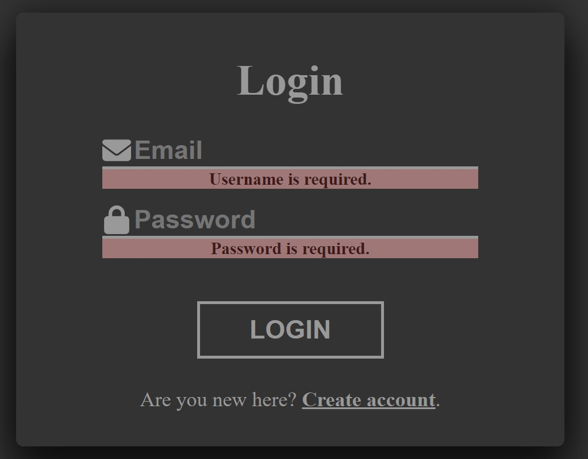

# Blog Application

My private blog application project. The idea is to create a blog application with users and functionality similar to Facebook. Adding posts, comments and chatting with others.
Application is based on Spring Boot backend with JWT token authentication, token are stored in the https cookie. Frontend of application is created in ReactJS.

## Technologies

### Backend:
- **Spring Boot**
- **JWT (JSON Web Tokens)**
- **PostgreSQL**

### Frontend:
- **ReactJS**
- **Redux**

## Screenshots

### Login panel

### Login panel validation

### Register panel

### Register panel validation

### Register success message

## Implementation plan

- [x] User Registration
- [x] User Authentication
- [ ] Reset password and Email verification
- [ ] Adding posts
- [ ] Adding comments
- [ ] User profile panel
- [ ] Administration panel
- [ ] Chat
